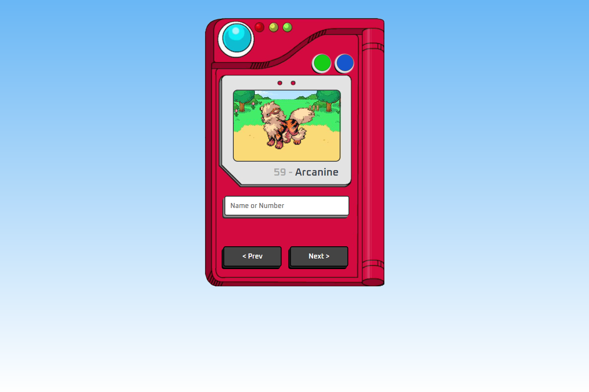

# Projeto Pokedéx

Projeto de Pokédex que utiliza como base o projeto do canal Manual do Dev - https://github.com/manualdodev/pokedex. A diferença é que eu incrementei dois botões com a opção de mostrar a versão shiny do pokémon e também os seus stats.

[Clique aqui para acessar](https://vitorbachini.github.io/pokedex/)

## Tecnologias

- HTML
- CSS
- JavaScript

## Contato

vbachiniw@gmail.com